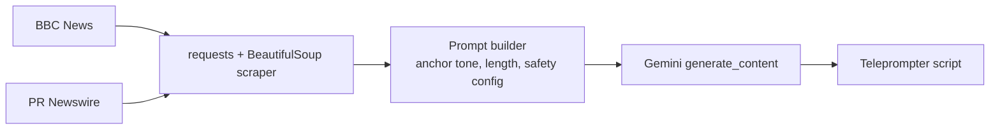

# newsAnchor 📰🎙️

> Turns live news into teleprompter‑ready scripts for an AI news‑anchor livestream. Scrapes BBC News and PR Newswire in real time, then uses Gemini to rewrite each story as broadcast copy.

[](https://www.python.org/)
[](https://ai.google.dev/)
[](LICENSE)

Built as the content engine for an AI livestream product: it removed the manual scripting step and cut content‑generation time by ~40% while keeping delivery accurate to the source article.

## How it works



| File | Purpose |
|---|---|
| `promptGenerator.py` | Scrape BBC headlines/articles → Gemini → anchor script |
| `prnewswireScrapper.py` | Same pipeline for PR Newswire press releases |

## Quickstart

```bash
git clone https://github.com/arhammxo/newsAnchor.git && cd newsAnchor
pip install -r requirements.txt
cp .env.example .env && export GEMINI_API_KEY=...   # never commit keys
python promptGenerator.py
```

## Notes

- Scraping respects the sites' `robots.txt`; use for personal/research purposes and check each publisher's terms before commercial use.
- Model name is set in each script (`gemini-pro`); swap for a current Gemini model as needed.

## License

MIT — see [LICENSE](LICENSE).
